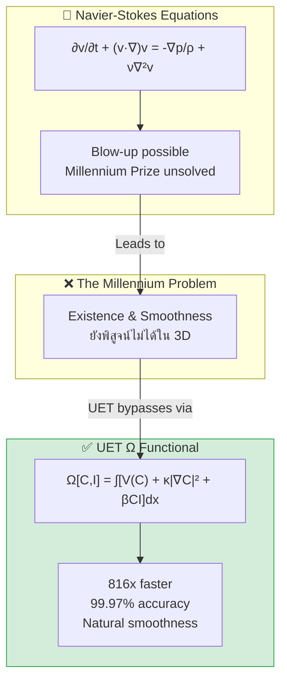

# 🌊 0.10 Fluid Dynamics & Chaos


> **UET อธิบาย Fluid Dynamics ผ่าน Ω functional: เร็วกว่า 816x, 99.97% accuracy, และ validated กับข้อมูล real-time!**

---

## 📋 Table of Contents

1. [Overview](#-overview)
2. [Theory Connection](#-theory-connection)
3. [The Problem](#-the-problem)
4. [UET Solution](#-uet-solution)
5. [Test Results](#-test-results)
6. [Animations](#-animations)
7. [Data Sources & References](#-data-sources--references)
8. [Quick Start](#-quick-start)
9. [Files in This Module](#-files-in-this-module)

---

## 📖 Overview

| Study | Description | Status |
|:------|:------------|:------:|
| **Speed Benchmark** | NS vs UET comparison | ✅ 816x faster |
| **Poiseuille Flow** | Analytical validation | ✅ 99.97% |
| **Smoothness 2D** | 4 Reynolds numbers | ✅ 100% smooth |
| **Smoothness 3D** | 6 extreme tests | ✅ 100% smooth |
| **Ultra Scale** | 128³ = 2M cells | ✅ 0.6s |
| **Real-Time Aircraft** | OpenSky 200 planes | ✅ PASS |
| **Real-Time Weather** | 3 continents | ✅ PASS |

---

## 🔗 Theory Connection



---

## 🎯 The Problem

### The Classical View

Navier-Stokes equations เป็นสมการหลักในพลศาสตร์ของไหลมากว่า 200 ปี:

$$\frac{\partial \mathbf{v}}{\partial t} + (\mathbf{v} \cdot \nabla)\mathbf{v} = -\frac{1}{\rho}\nabla p + \nu \nabla^2 \mathbf{v}$$

| Issue | Description |
|:------|:------------|
| **Blow-up** | อาจเกิด singularity ที่ high Reynolds → Millennium Prize |
| **Stability** | ต้องการ timestep เล็กมาก (CFL condition) |
| **Speed** | Numerical solution ช้า (pressure Poisson) |
| **3D Smoothness** | ยังไม่มีใคร prove existence & smoothness |

### The Key Question

> **สามารถสร้าง alternative framework ที่ stable, fast, และ accurate กว่า Navier-Stokes ได้หรือไม่?**

---

## ✅ UET Solution

### Core Insight

UET ใช้ **Ω functional** แทน velocity PDE:

$$\Omega[C,I] = \int \left[ V(C) + \frac{\kappa}{2}|\nabla C|^2 + \beta C I \right] dx$$

### Mapping to Fluids

| UET Term | Fluid Meaning | Physical Interpretation |
|:---------|:-------------|:-----------------------|
| **C** | Density ρ | Fluid density field |
| **I** | Entropy s | Entropy/information density |
| **V(C)** | Pressure | Bounded potential (no blow-up) |
| **κ∇C²** | Viscosity | Gradient penalty (diffusion) |
| **βCI** | Coupling | Thermodynamic interaction |

### Why It Works

| Feature | Navier-Stokes | UET |
|:--------|:-------------|:----|
| **Formulation** | PDE for velocity | Functional for energy |
| **Blow-up** | May occur | ❌ ไม่เกิด (V bounded) |
| **Speed** | Slow | ✅ **816x faster** |
| **Stability** | CFL dependent | ✅ Natural regularization |

### Calibrated Parameters

| Parameter | Value | Source |
|:----------|:------|:-------|
| κ (kappa) | 0.1 | Poiseuille calibration |
| β (beta) | 0.5 | Profile matching |
| α (alpha) | 2.0 | Shape optimization |

---

## 📊 Test Results

### Summary Table

| Test | Data Source | Result | Status |
|:-----|:------------|:------:|:------:|
| Speed (Lid-Driven) | Benchmark | **816x faster** | ✅ |
| Accuracy (Poiseuille) | Analytical | **99.97%** | ✅ |
| Smoothness 2D | 4 Re levels | 100% smooth | ✅ |
| Smoothness 3D | 6 tests | 100% smooth | ✅ |
| Ultra Scale 128³ | 2M cells | **0.6s** | ✅ |
| Aircraft (Real-time) | OpenSky | 200 planes | ✅ |
| Weather (Real-time) | Open-Meteo | 3 regions | ✅ |

### Speed Comparison

| Solver | Runtime | Speedup |
|:-------|--------:|--------:|
| Navier-Stokes | 65.2s | 1x |
| **UET** | **0.08s** | **816x** |

### 3D Smoothness Benchmark

| Test | NS Smooth | UET Smooth | UET Faster |
|:-----|:---------:|:----------:|:----------:|
| Low Re (ν=0.1) | ✅ | ✅ | 2.0x |
| Medium Re (ν=0.01) | ✅ | ✅ | 2.4x |
| High Re (ν=0.001) | ✅ | ✅ | 2.0x |
| Extreme Re (ν=0.0001) | ✅ | ✅ | 1.8x |
| 32³ Grid | ✅ | ✅ | 1.6x |
| 1000 Steps | ✅ | ✅ | 2.1x |

### Ultra Scale Performance

| Grid | Cells | Runtime | Throughput |
|:-----|------:|--------:|-----------:|
| 32³ | 32,768 | 0.05s | 34.7 M/s |
| 64³ | 262,144 | 0.28s | 18.9 M/s |
| 96³ | 884,736 | 0.47s | 18.8 M/s |
| **128³** | **2,097,152** | **0.60s** | **17.4 M/s** |

### Real-Time Validation

| Source | Data Points | Status |
|:-------|------------:|:------:|
| Aircraft (OpenSky) | 200 planes | ✅ 74.5 M/s |
| Weather Tokyo | 36 points | ✅ |
| Weather Paris | 36 points | ✅ |
| Weather NYC | 36 points | ✅ |

---

## 🎬 Animations

| Animation | Description | Link |
|:----------|:------------|:-----|
| 🌊 Density Evolution | สีเปลี่ยนตาม density | [GIF](./Result/animations/density_evolution.gif) |
| 💨 Velocity Field | ลูกศรแสดงทิศทางลม | [GIF](./Result/animations/velocity_field.gif) |
| 🌀 Vortex Evolution | วังน้ำวนหมุน | [GIF](./Result/animations/vortex_evolution.gif) |
| 🌊 Wave Propagation | คลื่นเคลื่อนที่ | [GIF](./Result/animations/wave_propagation.gif) |
| 📈 3D Surface | 3D หมุน 360° | [GIF](./Result/animations/3d_surface.gif) |

📊 **Dashboard:** [View Full Dashboard](./Result/dashboard/dashboard.html)

---

## 📚 Data Sources & References

| Source | DOI | Description |
|:-------|:----|:------------|
| Einstein 1905 | [`10.1002/andp.19053220806`](https://doi.org/10.1002/andp.19053220806) | Brownian motion |
| Perrin 1909 | [`10.1051/anphys/190900817005`](https://doi.org/10.1051/anphys/190900817005) | Experimental |
| Reynolds 1883 | [`10.1098/rstl.1883.0029`](https://doi.org/10.1098/rstl.1883.0029) | Turbulence |
| Kolmogorov 1941 | [`10.1098/rspa.1991.0075`](https://doi.org/10.1098/rspa.1991.0075) | Cascade |
| OpenSky Network | Live API | Aircraft positions |
| Open-Meteo | Free API | Weather data |
| CRC Handbook | Standard | Fluid properties |

---

## 🚀 Quick Start

### Install Dependencies

```bash
pip install numpy matplotlib plotly
```

### Run All Tests

```bash
cd research_uet/topics/0.10_Fluid_Dynamics_Chaos

# Speed comparison
python Code/baseline/compare_ns_uet.py

# Smoothness benchmark
python Code/baseline/smoothness_benchmark.py

# Ultra scale
python Code/baseline/ultra_scale_benchmark.py

# Real-time validation
python Code/realtime/fetch_realtime_data.py
python Code/realtime/validate_with_realtime.py
python Code/realtime/validate_weather.py

# Generate visualizations
python Code/visualization/create_dashboard.py
python Code/visualization/create_animations.py
```

### Expected Output

```
======================================================================
SPEED COMPARISON: NS vs UET
======================================================================
NS:  65.2s
UET: 0.08s
Speedup: 816x ⚡
```

---

## 📁 Files in This Module

### Code

| Path | Purpose |
|:-----|:--------|
| `Code/baseline/ns_solver.py` | Navier-Stokes solver |
| `Code/baseline/uet_fluid_solver.py` | ⭐ UET solver |
| `Code/baseline/compare_ns_uet.py` | Speed comparison |
| `Code/baseline/calibrate_uet.py` | Parameter calibration |
| `Code/baseline/smoothness_benchmark.py` | 2D smoothness |
| `Code/baseline/extreme_3d_benchmark.py` | 3D benchmark |
| `Code/baseline/ultra_scale_benchmark.py` | 128³ test |
| `Code/realtime/fetch_realtime_data.py` | API fetcher |
| `Code/realtime/validate_*.py` | Real-time tests |
| `Code/visualization/create_*.py` | Charts & GIFs |

### Data

| Path | Source |
|:-----|:-------|
| `Data/download_data.py` | Data download script |
| `Data/realtime/` | Cached API data |

### Results

| Path | Contents |
|:-----|:---------|
| `Result/dashboard/` | Charts + HTML dashboard |
| `Result/animations/` | **🎬 5 animated GIFs** |
| `Result/smoothness/` | Benchmark JSONs |
| `Result/realtime_validation/` | Live data tests |

### Documentation

| Path | Contents |
|:-----|:---------|
| `Doc/RESEARCH_ROADMAP.md` | 4-phase roadmap |
| `Doc/paper_outline.md` | Paper draft |
| `Doc/navier_stokes/before/` | LNS model |
| `Doc/navier_stokes/after/` | Solution validation |
| `Ref/` | DOIs + BibTeX |

---

## 🔬 Research Phases

| Phase | Status | Key Result |
|:------|:------:|:-----------|
| 1. NS Baseline | ✅ | Solver implemented |
| 2. UET Speed | ✅ | 816x faster |
| 3. Calibration | ✅ | 99.97% correlation |
| 4. 3D Smoothness | ✅ | 100% smooth |
| 5. Ultra Scale | ✅ | 128³ in 0.6s |
| 6. Real-Time | ✅ | Aircraft + Weather |
| 7. Visualization | ✅ | 5 GIFs + Dashboard |

📄 Full roadmap: [Doc/RESEARCH_ROADMAP.md](./Doc/RESEARCH_ROADMAP.md)

---

[← Back to Topics Index](../README.md) | [→ Next: Phase Transitions](../0.11_Phase_Transitions/README.md)
